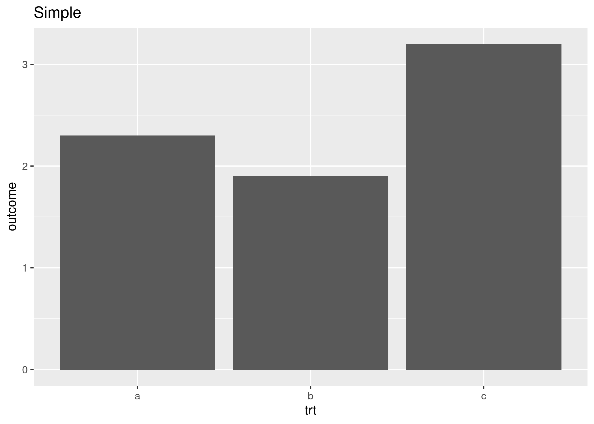

If you have build your homepage using blogdown, it's actually quite simple to integrate Javascript snippets in it.
While this is mentioned in the book ["blogdown: Creating Websites with R Markdown"](https://bookdown.org/yihui/blogdown/javascript.html), it still took me a little bit to undertstand how it works.

As an example, let's make different versions of a simple plot and let the user decide which one to display.
First I make the plots and save them in a sub-directory:

```{r message=FALSE, warning=FALSE}
library(ggplot2)
df <- data.frame(trt = c("a", "b", "c"), outcome = c(2.3, 1.9, 3.2))
dir.create("./plots")
simple <- ggplot(df, aes(trt, outcome)) +
  geom_col() + 
  ggtitle("Simple")
ggsave("./plots/simple.png", simple)

minimal <- ggplot(df, aes(trt, outcome)) +
  geom_col() + 
  theme_minimal() +
  ggtitle("Minimal Theme")
ggsave("./plots/minimal.png", minimal)

minimal <- ggplot(df, aes(trt, outcome, fill = trt)) +
  geom_col() + 
  theme_minimal() +
  ggtitle("Minimal Theme")
ggsave("./plots/colors.png", minimal)
```

First, you have to include a bit of HTML code into the .Rmd file.
This adds the image and dropdown menu:

```
<select id="imgList">
  <option value="./plots/simple.png">Simple</option>
  <option value="./plots/minimal.png">Minimal Theme</option>
  <option value="./plots/colors.png">With Colours</option>
</select>

```

Simply paste this into your .Rmd file and blogdown will do the rest.

Now we need to add the JavaScript code.
Otherwise the dropdown menu will do nothing.
Again simply paste this script into your .Rmd file:

```
<script type="text/javascript">             
var img = document.getElementById("image");

function setClass(e) {
  var select = e.target;
  img.src = select.options[select.selectedIndex].value;
  return false;
}

document.getElementById("imgList").onchange = setClass;
</script>
```

If you find JavaScript on, for example, [stackoverflow.com](https://stackoverflow.com/a/39176549/5028841), remember to wrap the code in `<script>` tags as above.  

The result can be seen below:

<select id="imgList">
  <option value="./plots/simple.png">Simple</option>
  <option value="./plots/minimal.png">Minimal Theme</option>
  <option value="./plots/colors.png">With Colours</option>
</select>


<script type="text/javascript">             
var img = document.getElementById("image");

function setClass(e) {
  var select = e.target;
  img.src = select.options[select.selectedIndex].value;
  return false;
}

document.getElementById("imgList").onchange = setClass;
</script>
  
Do you have a more automated way to get this done or have ideas how to improve the code above?
Let me know in the comments (on my website, if you're reading this on R-bloggers).
