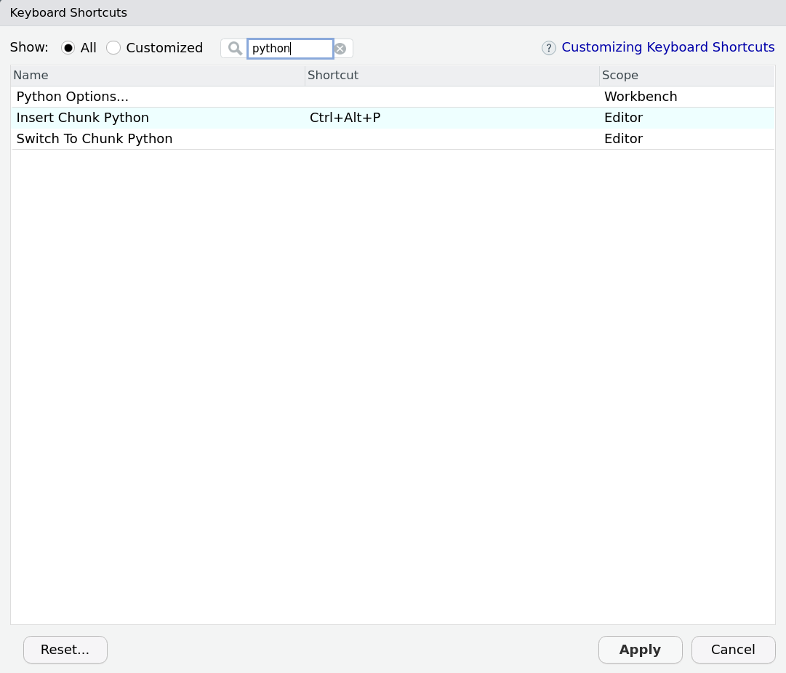

I have tried to venture into Python several times over the years.
The language itself seems simple enough to learn but as someone who has only ever used `R` (and a bit of Stata), there were two things that held me back:

1. I never really found an IDE that I liked.
I tried a few different ones including Spyder and Jupyter Notebook (not technically an IDE) and compared to RStudio and R Markdown they felt rather limited.
Most Python users I met seem to think IDEs are not really important, which confuses me even further.
That's what you look at the entire time while programming!
<!-- Did you try PyCharm? Anyhow, we are at the same page, if you're accustomed to RStudio it feels like diving into some 80s madness of programming using Python - and the support from the community is not as big as for R, I feel. -->

2. I could never really wrap my head around installing and updating Python packages.
Whenever I set up doing a Python course, I struggled with incompatible packages, my IDE or pip grabbing the wrong version of Python or both.
At one point I nuked my entire Linux installation and had to format my drive all because I wanted to install `spaCy`.

The good news is: the great people over at  `RStudio` solved both these problems at some point during the last years and I only noticed now. 
So here I wanted to quickly share what I've learned venturing into Python using RStudio, `reticulate` and R Markdown.

## Setting up Python

Unlike in R, installing and managing packages in Python is a flaming pile of garbage.
Maybe that is an exaggeration and it only looks like that for a beginner, but every Python programmer I asked had at least a couple of problems installing packages (while this is relatively rare with R).
Consequently, the Python community seems to be moving towards a workaround (instead of fixing this poor state of affairs), which consists of installing Python and the corresponding library of packages into a separate folder for each project, called a "virtual environment".^[See <https://docs.python.org/3/library/venv.html#:~:text=A%20virtual%20environment%20is%20a,part%20of%20your%20operating%20system.> for more information.]
This is what the developers of `reticulate` suggest:
> "When installing Python packages it’s typically a good practice to isolate them within a Python environment (a named Python installation that exists for a specific project or purpose). This provides a measure of isolation, so that updating a Python package for one project doesn’t impact other projects" [source](https://rstudio.github.io/reticulate/articles/python_packages.html).

Okay...
Then let's do that; we can set up a conda environment inside our working directory using `reticulate::conda_create`.^[
This creates a conda environment. You can also create a vanilla Python environment with `reticulate::virtualenv_create`, but I found these harder to manage.
] 

```{r eval=FALSE}
reticulate::conda_create("./python-env-test/")
```

You only have to do this once for a new project, so I would suggest you create an RStudio project and in the first script of the project, you use the following code to check if the environment exists and install it if it's not there yet.
As far as I can see it does not cause any problems if you delete this folder manually later and start from scratch.

```{r}
if (!dir.exists("./python-env-test/")) {
  reticulate::conda_create("./python-env-test/")
}
```

Next, we need to tell RStudio to use this installation of Python rather than a different one it might find somewhere on your computer.
I found the easiest way to do so is to set an environment variable in `R`:

```{r}
# search for a Python installation in your working directory
py_bin <- grep(getwd(), reticulate::conda_list()$python, value = TRUE)
Sys.setenv(RETICULATE_PYTHON = py_bin)
```

You can run this code every time you use reticulate or make the configuration persistent using an `.Rprofile` file (for example, with `usethis::edit_r_environ()`).
If you are in a new project and have no `.Rprofile` file yet, you can simply use the following chunk to create one:

```{r}
writeLines(
  paste0("RETICULATE_PYTHON = ", paste0(getwd(), "/python-env-test/bin/python")), 
  paste0(here::here(), ".Rprofile")
)
```


## Installing Python Packages

Now you're all set with your virtual environment, RStudio project, and .Rprofile, we can install some packages through `reticulate`.
`reticulate` offers two functions: one for packages from Anaconda, one for packages from pip.
`reticulate::conda_install` also manages system dependencies (unlike pip), which is why this is my first choice.
Only if packages are not available on conda, I turn to `reticulate::py_install`:

```{r eval=FALSE}
reticulate::conda_install(
    packages = c("scikit-learn", "pandas"),
    envname = "./python-env-test/"
)
reticulate::py_install(
  packages = c("tmtoolkit", "gensim"),
  envname = "./python-env-test/",
  pip = TRUE
)
```


## Using Python in RStudio

Now we are finally all set to play around with Python itself.
There are two ways in which you can use Python in an R Markdown document (that I know of).
The first is to use Python chunks instead of R chunks.
So where you would usually write:

```{r comment=NA, echo=FALSE}
cat("```{r}\ntext <- \"Hello World! From R\"\nprint(text)\n```")
```

```{r echo=FALSE}
text <- "Hello World! From R"
print(text)
```

you now write

```{r comment=NA, echo=FALSE}
cat("```{python}\ntext = \"Hello World! From Python\"\nprint(text)\n```")
```

```{python echo=FALSE}
text = "Hello World! From Python"
print(text)
```

You can even set a new keyboard shortcut to create these chunks (Tools -> "Modify Keyboard Shortcuts..."):



What is super cool about `reticulate` (which is working in the background here) is that it seems to know quite well how to translate Python objects into R and the other way around:

```{r}
library(reticulate)
# In R
print(py$text)
```

```{python}
# In Python
print(r.text)
```

If you use a newer version of RStudio, you can even see the Python objects in your Environment Pane:


The second way to use Python code is from R directly:

```{r}
pd <- import("pandas")
pd$DataFrame(1:5)
```

Here we import the package `pandas` as an object called `pd`. 
To call functions from the package, you use the `$` operator. 
Then, we create a data frame in Python. 
To find help on a function, you can use `py_help(pd$DataFrame)`.

## Case Study - NMF topic models from scikit-learn

This makes the `reticulate` + RStudio + R Markdown setup incredibly powerful.
Let's say you want to try out Non-Negative Matrix Factorization (NMF) from `scikit-learn` for doing topic modelling.
You can do all your preprocessing in `R`s `quanteda` and then use scikit-learn to run the model.
Afterwards, you can switch back to `R` to visualise the outcome with `ggplot2`.
So let's do that!

I first create a `dfm` from some made up text:

```{r}
library(quanteda)
test_dfm <- c("A", "A", "A B", "B", "B", "C") %>% 
  tokens() %>% 
  dfm()
test_dfm
```

Now, we can use this `dfm` with scikit-learn and train a model with two topics:

```{r}
sklearn <- import("sklearn")
model <- sklearn$decomposition$NMF(
  n_components = 2L,  # number of topics
  random_state  =  5L # equivalent of seed for reproducibility
)$fit(test_dfm)
```

Note, that to load `scikit-learn` you need to import `"sklearn"`.^[I spent 3 hours to find that the "-" causes trouble...] 
Also note, that you set the parameters inside `NMF` and then add the data in `fit` as the `$` (which represents the `.` in Python) basically acts like a pipe.

We can evaluate this model in R like so:

```{r}
beta <- model$components_
colnames(beta) <- featnames(test_dfm)
rownames(beta) <- paste0("topic_", seq_len(nrow(beta)))
beta
```

```{r}
gamma <- model$transform(test_dfm)
colnames(gamma) <- paste0("topic_", seq_len(ncol(gamma)))
rownames(gamma) <- paste0("text_", seq_len(nrow(gamma)))
gamma
```

And as promised, here is a quick ggplot based off these data:

```{r}
library(tidyverse)
beta %>% 
  as_tibble(rownames = "topic") %>% 
  pivot_longer(cols = -topic) %>% 
  ggplot(aes(x = value, y = name)) +
  geom_col() +
  facet_wrap(~topic) +
  theme_minimal() +
  labs(x = NULL, y = NULL, title = "Top-features per topic")
```

Not very impressive, but if you had real data, you could easily reproduce Julia Silge's plot from her [book about text mining](https://www.tidytextmining.com/topicmodeling.html#word-topic-probabilities), which means I can work with this model as I would with any other topic model implementation in R!

