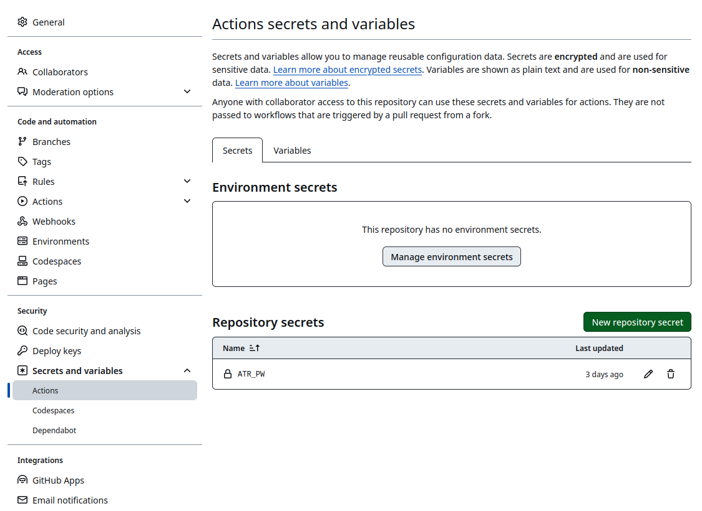

```{r setup, include=FALSE}
knitr::opts_chunk$set(eval = FALSE)
```

Bluesky is shaping up to be a nice, "billionaire-proof"^[
Once the protocol fulfills its vision that one can always take their follower network and posts to a different site using the protocol.
] replacement of what Twitter once was.
To bring back a piece of the thriving R community that once existed on ex-Twitter, I decided to bring back the [R-Bloggers bot](https://bsky.app/profile/r-bloggers.bsky.social), which spread the word about blog posts from many R users and developers.
Especially when first learning R, this was a very important resource for me and I created my first package using [a post from R-Bloggers](https://www.r-bloggers.com/2014/04/writing-an-r-package-from-scratch/).
Since I have recently published the [`atrrr`](https://www.johannesbgruber.eu/post/2024-01-09-release-atrrr/) package with a few friends, I thought it was a good opportunity to promote that package and show how you can write a completely free bot with it.

You can find the bot at <https://github.com/JBGruber/r-bloggers-bluesky>.
This posts describes how the parts fit together.

# Writing the R-bot

The first part of my bot is a minimal RSS parser to get new posts from <http://r-bloggers.com>.
You can parse the content of an RSS feed with packages like `tidyRSS`, but I wanted to keep it minimal and not have too many packages in the script.^[
While you can do some caching, packages need to be installed on each GitHub Actions run, meaning that every extra package increases the run time quite a bit.
]
I won't spend too much time on this part, because it will be different for other bots.
However, if you want to build a bot to promote content on your own website or your podcast, RSS is well-suited for that and often easier to parse than HTML.

```{r}
## packages
library(atrrr)
library(anytime)
library(dplyr)
library(stringr)
library(glue)
library(purrr)
library(xml2)

## Part 1: read RSS feed
feed <- read_xml("http://r-bloggers.com/rss")
# minimal custom RSS reader
rss_posts <- tibble::tibble(
  title = xml_find_all(feed, "//item/title") |>
    xml_text(),

  creator = xml_find_all(feed, "//item/dc:creator") |>
    xml_text(),

  link = xml_find_all(feed, "//item/link") |>
    xml_text(),

  ext_link = xml_find_all(feed, "//item/guid") |>
    xml_text(),

  timestamp = xml_find_all(feed, "//item/pubDate") |>
    xml_text() |>
    utctime(tz = "UTC"),

  description = xml_find_all(feed, "//item/description") |>
    xml_text() |>
    # strip html from description
    vapply(function(d) {
      read_html(d) |>
        xml_text() |>
        trimws()
    }, FUN.VALUE = character(1))
)
```

To create the posts for Bluesky, we have to keep in mind that the platform has a 300 character limit per post.
I want the posts to look like this:

> title
>
> first sentences of post
>
> post URL

The first sentence of the post needs to be trimmed then to 300 characters minus the length of the title and URL.
I calculate the remaining number of characters and truncate the post description, which contains the entire text of the post in most cases.

```{r}
## Part 2: create posts from feed
posts <- rss_posts |>
  # measure length of title and link and truncate description
  mutate(desc_preview_len = 294 - nchar(title) - nchar(link),
         desc_preview = map2_chr(description, desc_preview_len, function(x, y) str_trunc(x, y)),
         post_text = glue("{title}\n\n\"{desc_preview}\"\n\n{link}"))
```

I'm pretty proud of part 3 of the bot:
it checks the posts on the timeline (excuse me, I meant skyline) of the bot (with the handle `r-bloggers.bsky.social`) and discards all posts that are identical to posts already on the timeline.
This means the bot does not need to keep any storage of previous runs.
It essentially uses the actual timeline as its database of previous posts.
Don't mind the `Sys.setenv` and `auth` part, I will talk about them below.

```{r}
## Part 3: get already posted updates and de-duplicate
Sys.setenv(BSKY_TOKEN = "r-bloggers.rds")
auth(user = "r-bloggers.bsky.social",
     password = Sys.getenv("ATR_PW"),
     overwrite = TRUE)
old_posts <- get_skeets_authored_by("r-bloggers.bsky.social", limit = 5000L)
posts_new <- posts |>
  filter(!post_text %in% old_posts$text)
```

To post from an account on Bluesky, the bot uses the function `post_skeet` (a portmanteau of "sky" + "twee.. I mean "posting").
Unlike most social networks, Bluesky allows users to backdate posts (the technical reasons are too much to go into here).
So I thought it would be nice to make it look like the publication date of the blog post was also when the post on Bluesky was made.

```{r}
## Part 4: Post skeets!
for (i in seq_len(nrow(posts_new))) {
  post_skeet(text = posts_new$post_text[i],
             created_at = posts_new$timestamp[i])
}
```

Update: after a day of working well, the bot ran into a problem where a specific post used a malformed GIF image as header image, resulting in:

```{r, echo=FALSE, eval=TRUE}
cli::cli_alert_danger(c(cli::col_white("Something went wrong [605ms]\n"),
                      "Error: insufficient image data in file `/tmp/Rtmp8Gat9r/file7300766c1e29c.gif' @ error/gif.c/ReadGIFImage/1049"))
```

So I introduced some error handling with `try`:

```{r}
## Part 4: Post skeets!
for (i in seq_len(nrow(posts_new))) {
  # if people upload broken preview images, this fails
  resp <- try(post_skeet(text = posts_new$post_text[i],
                         created_at = posts_new$timestamp[i]))
  if (methods::is(resp, "try-error")) post_skeet(text = posts_new$post_text[i],
                                                 created_at = posts_new$timestamp[i],
                                                 preview_card = FALSE)
}
```

# Deploying the bot on GitHub

Now I can run this script on my computer and the `r-bloggers.bsky.social` will post about all blog post currently in feed on http://r-bloggers.com/rss!
But for an actual bot, this needs to run not once but repeatedly!

So the choice is to either deploy this on a computer that is on 24/7, like a server.
You can get very cheap computers to do that for you, but you can also do it completely for free running it on someone else's server (like a pro).
One such way is through [Github Actions](https://github.com/features/actions).

To do that, you need to create a free account and move the bot script into a repo.
You then need to define an "Action" which is a pre-defined script that sets up all the neccesary dependencies and then executes a task.
You can copy and paste the action file from <https://github.com/JBGruber/r-bloggers-bluesky/blob/main/.github/workflows/bot.yml> into the folder `.github/workflows/` of your repo:

```{r echo=FALSE, eval=TRUE, results='asis'}
yml <- readLines("https://raw.githubusercontent.com/JBGruber/r-bloggers-bluesky/main/.github/workflows/bot.yml") |>
  paste(collapse = "\n")

cli::cat_line("```\n", yml, "\n```")
```

# Authentication

We paid close attention to make it as easy as possible to [authenticate yourself using `atrrr`](https://jbgruber.github.io/atrrr/).
However, on a server, you do not have a user interface and can't enter a password.
However, you also do not want to make your key public!
So after following the authentication steps, you want to put your bot's password into `.Renviron` file (e.g., by using `usethis::edit_r_environ()`).
The you can use `Sys.getenv("ATR_PW")` to get the password in R.
Using the `auth` function, you can explitily provide your username and password to authenticate your bot to Bluesky without manual intervention.
To not interfere with my main Bluesky account, I also set the variable `BSKY_TOKEN` which defines the file name of your token in the current session.
Which leads us to the code you saw earlier.

```{r}
Sys.setenv(BSKY_TOKEN = "r-bloggers.rds")
auth(user = "r-bloggers.bsky.social",
     password = Sys.getenv("ATR_PW"),
     overwrite = TRUE)
```

Then, the final thing to do before uploading everything and running your bot n GitHub for the first time is to make sure the Action script has access to the environment variable (NEVER commit your `.Renviron` to GitHub!).
The way you do this is by nagvigating to `/settings/secrets/actions` in your repository and define a repository secret with the name `ATR_PW` and your Bluesky App password as the value.



And that is it.
A free Bluesky bot in `R`!
