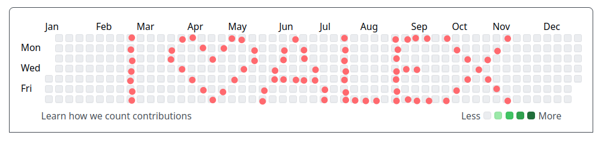

I like to make something myself to show my appreciation for my significant other.
So like [in 2019](https://www.johannesbgruber.eu/post/you-r-my-valentine/), [2020](https://www.johannesbgruber.eu/post/you-r-my-valentine-2-0/) and [2023](https://www.johannesbgruber.eu/post/you-r-my-valentine-3-0/) I'm writing some code for my wonderful special R-Lady -- which I happen to be better at than at arts and crafts.
Last year, we talked a lot about Git, the version control system you might know from GitHub and which is the default for collaborative work on code.
Because since she started using it for work last year, I'm not the only one in our household who is frustrated by merge conflicts any more.
And for whatever reason, I only realised in the last few months that it is actually possible [to use Git via `R` scripts](https://docs.ropensci.org/git2r/) instead of googleing or llming the commands every time.
So let's see if I can craft a nerdy Git(Hub) message this year.

Specifically, I want to make some contributions that show up in my GitHub contributions calendar like this:

[](https://github.com/JBGruber?tab=overview&from=2009-01-01&to=2009-12-31)

Each green box (in case I used red to sketch my message out) shows something I added to a repository on GitHub.
And the crucial piece of information is that commits can be backdated.
So when I pick a view from a year in which I did not use GitHub yet, I have an empty canvas to draw something with code!

So let's first define all the points I want to draw:

```{r}
points <- c(
  # I
  seq.Date(as.Date("2009-02-22"), as.Date("2009-02-28"), by = 1L),
  
  # heart
  as.Date("2009-03-23"), as.Date("2009-03-24"), 
  as.Date("2009-03-29"), as.Date("2009-04-01"),
  as.Date("2009-04-05"), as.Date("2009-04-09"),
  as.Date("2009-04-13"), as.Date("2009-04-17"),
  as.Date("2009-04-21"), as.Date("2009-04-25"),
  as.Date("2009-04-27"), as.Date("2009-05-01"),
  as.Date("2009-05-03"), as.Date("2009-05-07"),
  as.Date("2009-05-10"), as.Date("2009-05-13"),
  as.Date("2009-05-18"), as.Date("2009-05-19"),
  
  # "ALEX"
  as.Date("2009-05-29"), as.Date("2009-05-30"), # left leg
  as.Date("2009-06-03"), as.Date("2009-06-04"),
  as.Date("2009-06-08"), as.Date("2009-06-09"),
  as.Date("2009-06-14"),
  as.Date("2009-06-22"), as.Date("2009-06-23"), #right leg
  as.Date("2009-07-01"), as.Date("2009-07-02"),
  as.Date("2009-07-10"), as.Date("2009-07-11"),
  # crossbar
  as.Date("2009-06-04") + 7, as.Date("2009-06-04") + 14, as.Date("2009-06-04") + 21,
  
  # L
  seq.Date(as.Date("2009-07-19"), as.Date("2009-07-25"), by = 1L),
  as.Date("2009-07-25") + 7, as.Date("2009-07-25") + 14, as.Date("2009-07-25") + 21,
  
  # E
  seq.Date(as.Date("2009-08-23"), as.Date("2009-08-29"), by = 1L),
  as.Date("2009-08-23") + 7, as.Date("2009-08-23") + 14, as.Date("2009-08-23") + 21,
  as.Date("2009-08-26") + 7, as.Date("2009-08-26") + 14,
  as.Date("2009-08-29") + 7, as.Date("2009-08-29") + 14, as.Date("2009-08-29") + 21,
  
  # X
  seq.Date(as.Date("2009-09-27"), as.Date("2009-11-14"), by = 8L),
  seq.Date(as.Date("2009-10-03"), as.Date("2009-11-08"), by = 6L)
)
```

To make sure the green squares will be in the right location, let's quickly check by recreating the contributions calendar as a plot:

```{r}
#| message: false
#| fig-height: 2
#| fig-width: 9
library(tidyverse)
tibble(
  weekday = wday(points, label = TRUE, week_start = 7L, locale = "en_GB.UTF-8"),
  week = epiweek(points) # I discovered this is the way GitHub counts weeks
) |> 
  ggplot(aes(x = week, y = fct_rev(weekday))) +
  geom_point(colour = "darkgreen", shape = 15L, size = 2L) +
  theme_minimal() +
  labs(x = NULL, y = NULL)
```

Now let's get to the Git part.
The package I'm using is `git2r`:

```{r}
#| echo: false
# make sure the repo does not exist before it is created
try(unlink("valentine-repo", recursive = TRUE), silent = TRUE)
```

```{r}
#| message: false
# install.packages("git2r")
library(git2r)
path <- "valentine-repo"
dir.create(path)
repo <- init(path)
summary(repo)
```

I initialised a new repository to store the commits in.
So far so good, but now comes the non standard part: 
backdating the commits to some day in 2009 (when we started dating).
To understand commits better, I first connect to the repository of this website:

```{r}
repo_ws <- repository(here::here())
```

Strangely enough, the commit time is saved in the author field of a commit.
Let's look at one of them:

```{r}
author <- commits(repo_ws)[[1]]$author
author
```

This looks like a special object, but is actually just a list with some formatting applied to it:

```{r}
unclass(author)
```

And the time is stored as a number:

```{r}
author$when$time
```

```{r}
#| echo: false
unlink("love.txt")
```

Knowing all that, I can write a loop to make the commits.
To make a commit, I need to change some file in the repository.
I decided to simply write a text file letter by letter with this message:

```{r}
msg <- c(
  strsplit("Will you be my valentine? ", "")[[1]],
  rep("<3", 54)
)
```

I add 54 `<3`s to make this the same length as the number of points, so I can use `walk2` to loop over `points` and `msg` simultaneously:

```{r}
purrr::walk2(points, msg, function(date, letter) {
  # add a letter to love.txx
  write(letter, "valentine-repo/love.txt", append = TRUE)

  # add the file to the commit
  add(repo, "valentine-repo/love.txt")
  
  # assign datetime to signature
  # (make it 9am every day to not get confused with time zones)
  datetime <- as.POSIXct(date, tz = "UTC") + 60 * 60 * 9 
  author$when$time <- as.numeric(datetime)
  
  commit(repo, "valentine commit", author = author, committer = author)
})
```

Let's have a look at the commits:

```{r}
commits(repo) |> 
  tail()
```

Excellent.
I don't like the default name of the branch that git assigns so let's rename it:

```{r}
branch_rename(repository_head(repo), "main")
```

I now had leave `R` for a second to create the repository on GitHub.
Then I can connect my local repository with the one on GitHub:

```{r}
remote_add(repo, name = "origin", url = "https://github.com/JBGruber/valentine-repo.git")
summary(repo)
```

Now I can push (upload) my commits (local changes)!

```{r}
#| eval: false
push(repo, name = "origin", refspec = "refs/heads/main", set_upstream = TRUE)
```

The result can be viewed here: <https://github.com/JBGruber?tab=overview&from=2009-01-01&to=2009-12-31>.
Happy nerdy valentine my dear and everyone :heart:!

